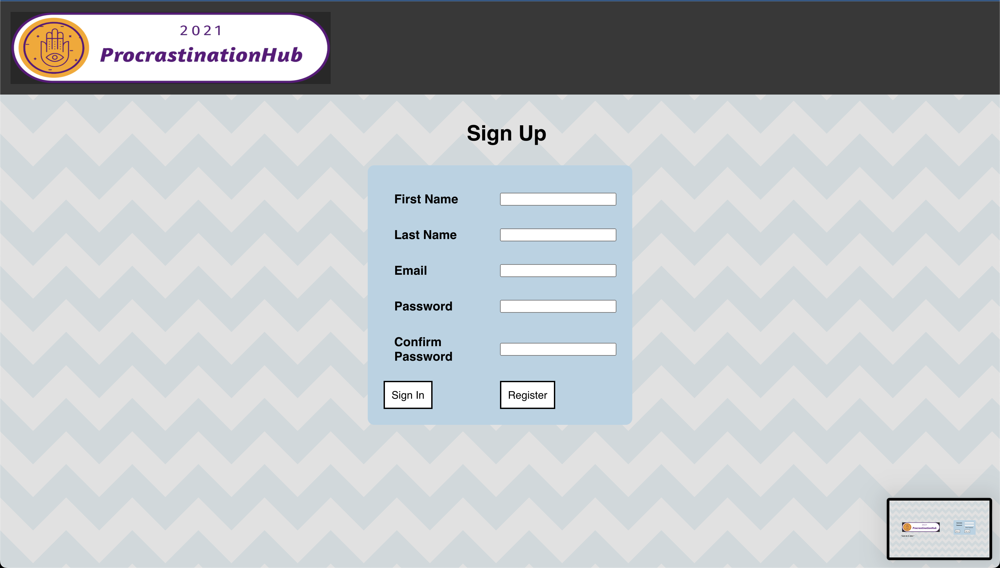
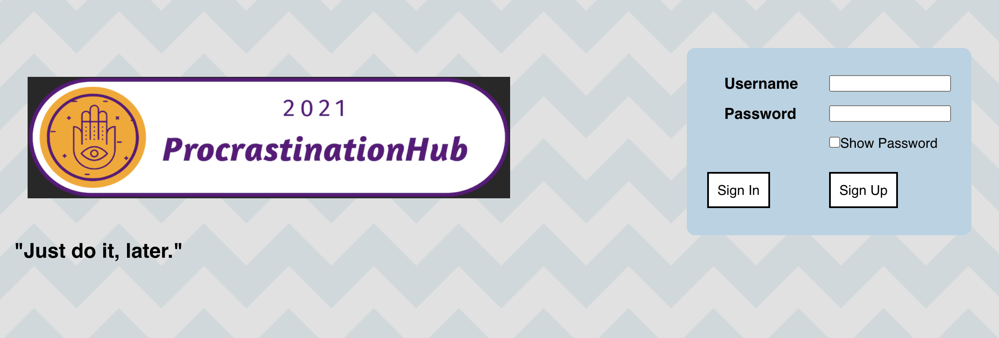
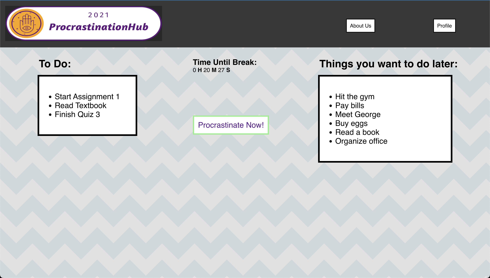
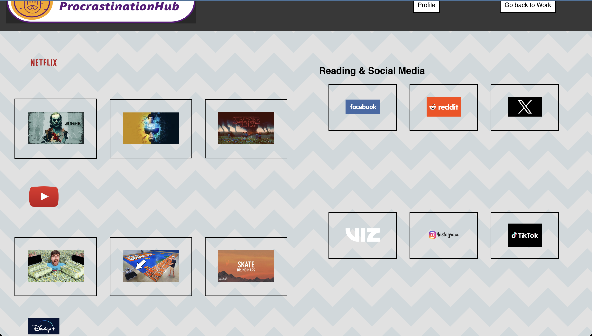
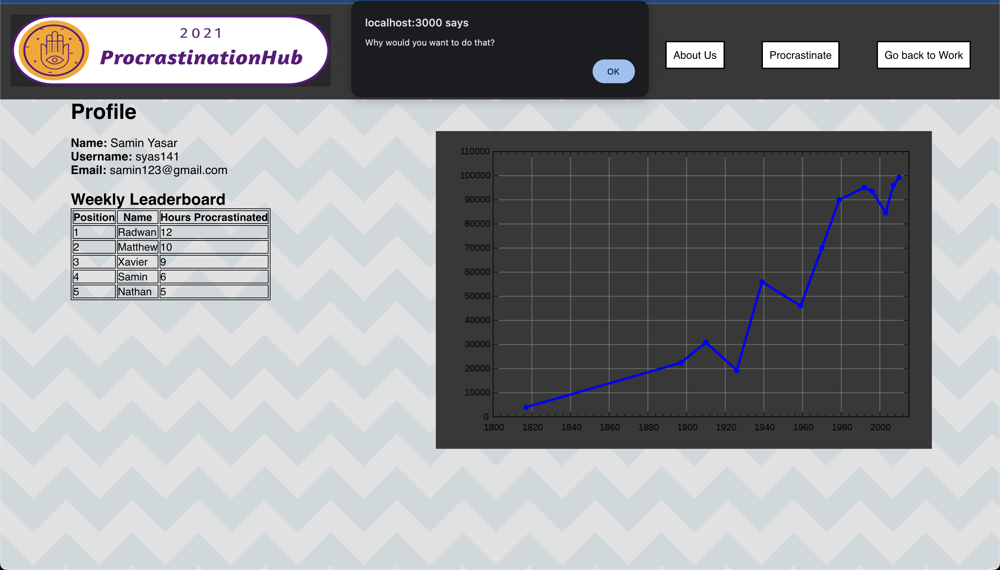

# Procrastination Hub - WDCC x SESA Hackathon 2021 

The scope of the project was to build a site to help students procrastinate(yes, you read that right). I was the project manager and built this site with 4 other developers within a 24hr period. 

We were all beginner programmers and had only recently started coding. This was the first web-project any of us had worked on and a dear one as we created this within such a short period of time and represented to 50+ people.

The site allows people to sign-up and sign-in page, tasks page, procrastination statistics and friends leaderboard page, procrastiantion page that links to various popular video streaming, social media and reading sites widely used to procrastinate and the user cannot go back to look at the tasks page and can only procrastinate once they are in.

- Use `npm install` then `npm start` to run the web-app.

## Features and Pages

### Sign-In & Sign-up Page
- User can sign up and then sign in to procrastinate

  

---

### Tasks Page
- User can add, remove and view they have to get done ASAP, but the **"Procrastinate Now"** button is tempting to click.

---

### Procrastination Page
- This is the pit of hell. The page has links to all major streaming, readin and social media platforms to keep you distracted forever(you already do this 😂). Once you enter this page, you cannot go back to the tasks page.

---

### Statistics & Leaderboard Page
- This page visualizes procrastination time and alos tracks a leaderboard so you check who has procrastianted the most.
- If you click "Go back to work", it warns you and asks why you would want to work.

